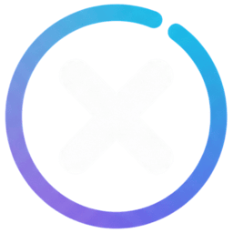

<div align="center">
  
  
  # Xtremio

  [](https://www.python.org/downloads/)
  [](https://flask.palletsprojects.com/)
  [](https://www.docker.com/)
  [](LICENSE)

  **A Flask API for interacting with Xtream servers, providing endpoints for configuration, manifest generation, metadata, catalogs, and streams.**

</div>

---

## 📋 Table of Contents

- [Features](#features)
- [Requirements](#requirements)
- [Installation](#installation)
  - [Docker (Recommended)](#docker-recommended)
  - [Local Installation](#local-installation)
- [Configuration](#configuration)
- [Usage](#usage)
- [Project Structure](#project-structure)
- [Environment Variables](#environment-variables)
- [API Endpoints](#api-endpoints)
- [Development](#development)
- [Contributing](#contributing)
- [License](#license)

## ✨ Features

- 🎬 Xtream server integration
- 🔐 Credential encryption with Fernet
- 🎭 TMDB integration for movie/series metadata
- 🐳 Full Docker support
- 🌐 CORS enabled
- 📦 Smart request caching
- 🔄 Automatic redirect support
- 🎨 Web interface for configuration

## 🔧 Requirements

- Python 3.9 or higher
- Docker and Docker Compose (for Docker installation)
- TMDB API account (optional, for enriched metadata)

## 🚀 Installation

### Docker (Recommended)

1. Clone the repository:
```bash
git clone https://github.com/Raddons/xtremio.git
cd xtremio
```

2. Create a `.env` file in the project root:
```bash
cp .env.example .env
```

3. Edit the `.env` file with your settings:
```env
FERNET_KEY=your_fernet_key_here
TMDB_API_KEY=your_tmdb_api_key_here
```

4. Start the containers:
```bash
docker-compose up -d
```

The application will be available at `http://localhost:5002`

### Local Installation

1. Clone the repository:
```bash
git clone https://github.com/Raddons/xtremio.git
cd xtremio
```

2. Create a virtual environment:
```bash
python -m venv venv
source venv/bin/activate  # Linux/Mac
# or
venv\Scripts\activate  # Windows
```

3. Install dependencies:
```bash
pip install -r api/requirements.txt
```

4. Set up environment variables:
```bash
export FERNET_KEY="your_fernet_key_here"
export TMDB_API_KEY="your_tmdb_api_key_here"
```

5. Run the application:
```bash
cd api
python index.py
```

## ⚙️ Configuration

### Generating a Fernet Key

To generate a new Fernet key, run:

```python
from cryptography.fernet import Fernet
key = Fernet.generate_key()
print(key.decode())
```

### Getting a TMDB API Key

1. Create an account at [The Movie Database](https://www.themoviedb.org/)
2. Go to [API Settings](https://www.themoviedb.org/settings/api)
3. Request an API Key
4. Copy the key to your `.env` file

## 📖 Usage

After starting the application, access:

- **Configuration Interface**: `http://localhost:5002/configure`
- **API Documentation**: See the [API Endpoints](#api-endpoints) section

## 📁 Project Structure

```
xtremio/
├── api/
│   ├── index.py              # Main Flask application
│   ├── requirements.txt      # Python dependencies
│   ├── static/              # Static files
│   │   ├── favicon.ico
│   │   └── logo.png
│   └── templates/           # HTML templates
│       ├── 404.html
│       ├── config.html
│       └── show_data.html
├── docker-compose.yml       # Docker Compose configuration
├── Dockerfile              # Docker image
├── .gitignore             # Git ignored files
├── .env.example           # Environment variables example
└── README.md             # This file
```

## 🔐 Environment Variables

| Variable | Description | Required | Default |
|----------|-------------|----------|---------|
| `FERNET_KEY` | Fernet encryption key | No* | Auto-generated |
| `TMDB_API_KEY` | TMDB API key | No | - |

*If not provided, a temporary key will be generated (not persistent across restarts)

## 🌐 API Endpoints

### Main Endpoints

- `GET /` - Home page
- `GET /configure` - Configuration interface
- `GET /manifest.json` - Addon manifest
- `GET /catalog/:type/:id` - Content catalog
- `GET /stream/:type/:id` - Content stream
- `GET /meta/:type/:id` - Content metadata

For a complete list of endpoints and their documentation, see the code in `api/index.py`.

## 🛠️ Development

### Running in development mode

```bash
cd api
export FLASK_ENV=development
export FLASK_DEBUG=1
python index.py
```

### Logs

Logs are configured at INFO level. To change:

```python
logging.basicConfig(level=logging.DEBUG)
```

### Tests

```bash
# TODO: Add test instructions when implemented
```

## 🤝 Contributing

Contributions are welcome! Please:

1. Fork the project
2. Create a feature branch (`git checkout -b feature/AmazingFeature`)
3. Commit your changes (`git commit -m 'Add some AmazingFeature'`)
4. Push to the branch (`git push origin feature/AmazingFeature`)
5. Open a Pull Request

## 📄 License

This project is licensed under the MIT License. See the `LICENSE` file for details.

## 👥 Authors

- Raddons - [@raddons](https://github.com/raddons)

## 🙏 Acknowledgments

- [Flask](https://flask.palletsprojects.com/)
- [TMDB](https://www.themoviedb.org/)
- [Cryptography](https://cryptography.io/)
- Open source community

---

⭐ If this project helped you, consider giving it a star!
